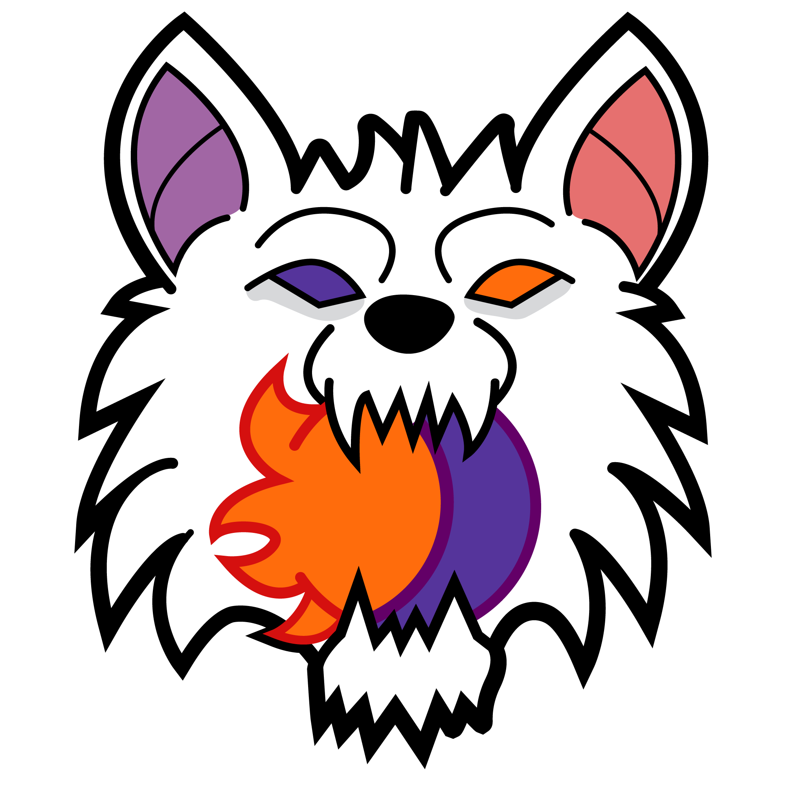

<div align="center">

<table>
  <tr>
    <td></td>
    <td><h1>🎓 TFG – Skhatoll</h1></td>
  </tr>
</table>

Aplicación web desarrollada como **Trabajo de Fin de Grado**, basada en una arquitectura
cliente-servidor con frontend SPA y backend desacoplado mediante API REST y WebSocket.

</div>

---

## 🧠 Descripción del proyecto

Skhatoll es una aplicación web desarrollada como proyecto académico, cuyo objetivo es
aplicar de forma práctica los conocimientos adquiridos durante el ciclo formativo de
**Desarrollo de Aplicaciones Web (DAW)**.

El proyecto sigue una **arquitectura MVC desacoplada**, separando claramente el frontend
y el backend, facilitando la escalabilidad, el mantenimiento y el trabajo en equipo.

---

## 🎲 Funcionalidad y objetivo de Skhatoll

Skhatoll es una plataforma digital que busca ayudar a los jugadores del juego de mesa de **Los Hombres Lobo de Castronegro** a gestionar sus partidas de una manera más cómoda, intuitiva y segura. Incluye guías y material de apoyo para orientar a los jugadores durante las partidas.

---

## 🛠️ Tecnologías

<p align="center">
    
</p>


---

## 📁 Estructura del repositorio

```text
Skhatoll/
├── backend/        # API REST y WebSocket (Spring Boot)
├── frontend/       # Aplicación SPA (Vue.js)
├── database/       # Scripts y configuración de base de datos
├── docker/         # Configuración Docker
├── docs/           # Documentación técnica
├── docker-compose.yml
└── README.md
```

# 🐺 Guía de instalación

## Vía Docker
1. Descargar el archivo docker-compose.yml
```
mkdir skhatoll
cd skhatoll
curl -O https://raw.githubusercontent.com/David-GutSal/Skhatoll/develop/docker-compose.yml
```
2. Crear .env __dentro del mismo directorio que docker-compose.yml__
3. Iniciar los contenedores
```
docker compose up -d
```
4. Aplicación disponible en: http://localhost

---

## Alternativa Manual
### Requisitos previos

- Node.js instalado (para el frontend)
- Java 21 instalado (para el backend)
- Maven instalado o usar el wrapper incluido (`mvnw`)
- IDE compatible: IntelliJ IDEA o Eclipse


---

### 📦 Descarga

En la sección **Releases** del repositorio encontrarás una versión *1.0* con todos los archivos necesarios para ejecutar el proyecto. Descarga y descomprime el archivo antes de continuar.

---

### ▶️ Ejecución del frontend

1. Abre una terminal y navega hasta la carpeta `frontend`
2. Instala las dependencias:
```bash
npm install
```
3. Arranca el servidor de desarrollo:
```bash
npm run dev
```
4. El frontend estará disponible en `http://localhost:5173`

---

### ▶️ Ejecución del backend

Antes de arrancar el backend es necesario configurar las variables de entorno con las credenciales de la base de datos y el secreto JWT.

### Variables necesarias

| Variable | Descripción |
|----------|-------------|
| `ALLOWED_ORIGIN` | URL desde la que se accederá al frontend de la aplicación. |
| `DB_URL` | URL de conexión a MySQL |
| `DB_USERNAME` | Usuario de la base de datos |
| `DB_PASSWORD` | Contraseña de la base de datos |
| `JWT_SECRET` | Clave secreta para firmar los tokens |
| `JWT_EXPIRATION` | Duración del token en segundos |

#### Valores de las variables
```
Estarán en la memoria en la sección de "Manual de despliegue".
```

_Posibles errores:_
- El backend ha sido desarrollado con **IntelliJ IDEA** el cual incorpora soporte / plugin para la dependencia de lombok, por lo que en el caso de que se use **Eclipse** es necesario ejecutar el .jar de lombok para instalarse como agente del IDE, sin esta dependencia no cargarán los constructores, getters, setters y propiedades del proyecto. Está posiblemente ubicado en:  _C:\Users\{tuUsuario}\.m2\repository\org\projectlombok\lombok\{version}\lombok-{version}.jar_
#
---

### IntelliJ IDEA

1. Ve a `Run` → `Edit Configurations`
2. Selecciona tu configuración de Spring Boot
3. En el campo **Environment variables** añade las variables separadas por `;`:
```
ALLOWED_ORIGIN=https://...;DB_URL=jdbc:mysql://...;DB_USERNAME=usuario;DB_PASSWORD=contraseña;JWT_SECRET=tu_secret;JWT_EXPIRATION=8640000
```
4. Pulsa **Apply** y luego **Run**

---

### Eclipse

1. Click derecho sobre el proyecto → `Run As` → `Run Configurations`
2. Selecciona tu configuración de Spring Boot
3. Ve a la pestaña **Environment** y pulsa **New** para añadir cada variable:

| Name | Value |
|------|-------|
| `ALLOWED_ORIGIN` | `https://...` |
| `DB_URL` | `jdbc:mysql://...` |
| `DB_USERNAME` | `usuario` |
| `DB_PASSWORD` | `contraseña` |
| `JWT_SECRET` | `tu_secret` |
| `JWT_EXPIRATION` | `8640000` |

4. Pulsa **Apply** y luego **Run**

---

### Línea de comandos

**Windows CMD:**
```cmd
set ALLOWED_ORIGIN=https://...
set DB_URL=jdbc:mysql://...
set DB_USERNAME=usuario
set DB_PASSWORD=contraseña
set JWT_SECRET=tu_secret
set JWT_EXPIRATION=8640000
mvn spring-boot:run
```

---
#
# 🧪 Cómo probar la aplicación

Para facilitar las pruebas, el número mínimo de jugadores para iniciar una partida se ha reducido a 3. Solo necesitas abrir **3 pestañas en modo incógnito** en tu navegador.

### Cuentas de prueba disponibles

Hay cuentas ya creadas listas para usar:

| Usuario | Contraseña |
|---------|------------|
| user1 — user11 | 1234 |

O puedes registrar una cuenta nueva desde la pantalla de inicio.

---

## 🎮 Como jugar una partida a Los Hombres Lobo de Castronegro

### Flujo de la partida

**0. Entrar a la Sala de Juegos**: Desde las opciones del menú de la página, accede a la opción **Sala de Juegos**
    - Recordatorio: inicia sesión o regístrate para poder entrar a la sala de juegos.
**1. Crear sala:** uno de los usuarios entra en *Sala de juegos* y pulsa *Crear sala*. Se generará un código único de sala.

**2. Unirse:** el resto de usuarios pulsan *Unirse a sala* e introducen el código generado.

**3. Asignar narrador:** el creador de la sala selecciona a un jugador de la lista como narrador. Si no se selecciona a ningún jugador, será el creador el narrador por defecto.

**4. Iniciar partida:** el creador de la sala pulsa *Comenzar partida* y a cada jugador se le asigna un rol en secreto.

**5. Durante la partida:**
- **Como en el juego físico,** el narrador es quien gestiona las fases y turnos de la partida, así como la activación de las habilidades de los personajes nocturnos. Por ello, será el propio narrador quien determine el orden de actuación de los jugadores siguiendo las normas del juego. La gestión de turnos se realiza manualmente con el objetivo de emular una partida presencial.
- **Al tratarse de un juego narrado,** gran parte del dinamismo de la partida depende del narrador, quien irá informando a los jugadores sobre los distintos acontecimientos que ocurran durante el juego (muertes, elecciones, etc.).
  - La función principal de las notificaciones es servir de apoyo al narrador, reforzando la información mostrada durante la partida sin sustituir la narración.

- El juego se divide en turnos donde cada turno se divide en 2 fases: **Día y noche.**

- **Panel de control del Narrador**
   - Antes del tablero de juego el narrador tiene un panel con estos botones. Algunos botones varían según la fase del turno:

      -  🛎️ **Botones permanentes**: están siempre en ambas fases.
         -  En la parte superior tiene 2 botones: el **Sol** y la **Luna** que son los botones para   cambiar entre las fases del día y la noche.
          - **Botones de Reglas y de Personajes:** al pulsar en ellos se abrirán unos desplegables debajo del tablero de juego con la información relacionada a su botón.
          - **Cancelar:** cierra la partida dejando el resultado en empate.

      - ☀️ **Durante el día**:
        - **Hacer Elecciones:** inicia las votaciones a la alcaldía. El jugador proclamado alcalde tendrá voto doble cuando se vote en un linchamiento.
        - **Provocar Linchamiento:** inicia las votaciones para eliminar de la partida a un jugador sospechoso que el resto de jugadores piensen que puede ser un lobo.
        - **Finalizar Votación:** cierra las votaciones activas (linchamiento o elección de alcalde).
      - 🌒 **Durante la noche**:
        - **Iniciar Eventos:** activa que los jugadores con poderes nocturnos puedan utilizarlos. El narrador seleccionará la carta del personaje en el tablero para indicar que es su turno.
        - **Finalizar Eventos**: cierra la fase de eventos donde los jugadores pueden usar sus poderes nocturnos
        - **Iniciar Votación Lobos**: abre las votaciones para que los Lobos elijan a qué jugador se van a comer. Si no se deciden y queda empate, esa noche no se comen a nadie.
        - **Finalizar Votación Lobos**: cierra las votaciones de los lobos
  


- **Panel de Control de los jugadores**
      
  - Además de algunos botones que sirven de ayuda, los jugadores tienen un panel con botones que varían según la fase del turno
    -  🛎️ **Botones permanentes**: están siempre en ambas fases.
        - **Mi Rol:** se encuentra bajo el tablero, sirve para consultar información del personaje en cualquier momento.
        - **Rendirse:**  está debajo del Botón **Mi Rol**, sirve para abandonar la partida dando por muerto a tu personaje.
        - **Subir Arriba:** te lleva a la parte superior de la página. Se encuentra al lado de **Rendirse.**
        - **Tu Enamorado:** botón especial que aparece en la parte baja del tablero del juego a los jugadores que han sido afectados por el enamoramiento de Cupido. Notifica a esos jugadores sobre quién es su pareja y las reglas del enamoramiento.
  
    - ☀️ **Durante el día:**
      - **Votar Alcalde:** Permite votar al alcalde tras pulsar en al carta del jugador. Si quiere cambiar el voto tiene que pulsar sobre otro jugador y volver a pulsar sobre ese botón pero solo puede hacerlo hasta que el Narrador cierre votaciones. El jugador puede abstenerse o autovotarse. 
      - **Votar Linchamiento:** funciona exactamente igual que **Votar Alcalde** pero sirve para eliminar a otro jugador de la partida. El jugador puede abstenerse o autovotarse. 
  
    - 🌒 **Durante la noche:**
      - **Ver mis poderes**: aparece bajo el panel de control del jugador después de que el Narrador toque a ese personaje en su tablero. El botón envía a la parte de abajo del tablero donde el jugador verá qué poderes tiene y qué puede hacer. Los botones de esta sección varían según los poderes de cada personaje. Explicaremos esas habilidades más adelante
      - **Botón finalizar poder:** aparecen en esa sección de los poderes y tiene un nombre distinto dependiendo del personaje pero su función es la misma: *finalizar su turno de usar los poderes para que el Narrador pueda seguir con el siguiente personaje.*


**6. Estructura de turnos de una partida**

*Esta organización de los turnos de cada jugador puede servir como guía para cualquier narrador y sigue el orden de las reglas del juego. La organización se va a hacer con los personajes que hemos implementado  pero siempre se pueden incluir o quitar personajes.*
- **Turno 1 de preparación**
  - **Fase Día:** El narrador abre las elecciones y se elige a un alcalde
  - **Fase Noche:** El narrador despierta a los jugadores en este orden para que utilicen sus poderes:
      1. Cupido
      2. Niño Salvaje
      
      *El turno introductorio podría acabar aquí y pasar a la nueva fase de día o empezar a usar al resto de personajes y que todo el mundo empiece a interactuar. Eso es a gusto del narrador.*

      3. Vidente (opcional)
      4. Niña (opcional)
      5. Hombres Lobo (opcional)
      6. Bruja (opcional)


- **Turno 2**
  - **Fase Día:**
    - El Narrador cuenta qué jugadores han muerto o si no ha muerto nadie generar sospechas para que los jugadores decidan linchar a alguien pero sin ponerse del lado de nadie.
    - Se abre debate sobre quién ha podido ser el asesino o quién puede ser un hombre lobo.
    - Se inician las votaciones para el linchamiento.
    - El jugador más votado muere.
      
  - **Fase Noche:** El narrador despierta a los jugadores en este orden para que utilicen sus poderes:
      1. Vidente (si sigue viva)
      2. Niña (si sigue viva)
      3. Hombres Lobo
      4. Bruja (si sigue viva)
- **Turno 3**
  - **Fase Día:** 
    - El Narrador vuelve a contar qué jugadores han muerto o si no ha muerto nadie abrir sospechas.
    - Se vuelve a abrir debate, votaciones y linchamiento de otro personaje.

  - **Fase Noche:** 
      - Seguiría el mismo orden que las anteriores.
      - Se repetirían las fases de forma cíclica hasta que gane uno de los bandos.

- **Fin de la partida:**
La partida termina cuando gana uno de los bandos o se cumplen ciertas condiciones
  - **Victoria para los Hombres Lobo:** todos los aldeanos han muerto.
  - **Victoria para los aldeanos:** todos los Hombres Lobo han muerto.
  - **Victoria para los Enamorados:** Los dos jugadores enamorados se han quedado solos en la partida.
  - **Empate:** Todos los jugadores han muerto o el Narrador ha cerrado la partida.


#
**7. Simulación de una partida**

    *Puede utilizarse esta simulación como guía para comprobar las funcionalidades de la partida

**TURNO 1**

☀️ ***Durante el día:***

- 📖 **Narrador:**
  - Tras una breve introducción hablando sobre el pueblo, el Narrador dice que no hay alcalde y que van a hacer unas elecciones a la alcaldía.
  - Los Jugadores presentan sus candidaturas dando razones para ser votados.
  - El Narrador pulsa en botón de **Hacer Elecciones** y avisa a los jugadores de que ya pueden elegir a su alcalde

- 🕹️**Jugador/es:**
  - En la pantalla de los jugadores aparecerá un mensaje de inicio de las elecciones
   Los jugadores tocarán a cualquier jugador del tablero y después pulsarán en **Votar Alcalde**. En caso de empate volverán a abrirse las elecciones
  - La Vidente es el personaje con más votos así que ahora es la alcaldesa.
  - El narrador avisa de que tras la celebración se hizo de noche y los jugadores se van a dormir (Todos cierran los ojos)
  - El Narrador pulsa en el botón de La Luna y anochece (se avisa a los jugadores pensando en una futura versión online)

🌒 ***Durante la noche:***

- 📖 **Narrador:**
  - El Narrador avisa de que van a iniciar los Eventos Nocturnos y que irá avisando a cada personaje. Tras decirlo pulsa en el botón de **Iniciar Eventos**
  - El Narrador avisa a Cupido de que abra los ojos y pulsa sobre su personaje en el tablero de juego

- 🕹️**Jugador/es: Cupido**
    - Tras Despertar Cupido ve una notificación de que es su turno para usar sus poderes además de que aparecerá el botón de **Ver mis poderes** en el Panel de Control. Cupido lo pulsará y le llevará abajo del tablero donde saldrá un desplegable con sus poderes
    - En ese tablero se le indicará que tocando sobre 2 personajes del tablero puede hacer que se enamoren.
    - Si quiere quitar un personaje y poner otro sólo tiene que quitarlo pulsando en la X que sale en la casilla del personaje. (Cupido enamorará al Cazador y a La Niña).
    - Cupido pulsa sobre Confirmar Flechazo para acabar su turno y enamorar a los jugadores.
    - Tanto los enamorados  como el Narrador serán notificados del flechazo.

- 📖 **Narrador:** 
  - El narrador continúa la partida, esta vez avisa y después pulsa sobre el Niño Salvaje.
- 🕹️**Jugador/es: Niño Salvaje**
  - Tras Despertar El Niño Salvaje ve una notificación de que es su turno para usar sus poderes además de que aparecerá el botón de **Ver mis poderes** en el Panel de Control. El Niño lo pulsará y le llevará abajo del tablero donde saldrá un desplegable con sus poderes.
  - Al niño le darán la opción de pulsar en el tablero sobre un jugador. (El Niño elegirá como mentora a la Niña)
  - Cuando se decida por uno, pulsará el botón **Mi Mentor** y se notificará al Narrador sobre el fin del turno del niño y verá quién es su mentor.
- 📖 **Narrador:**
  - El Narrador repitiendo el patrón de los otros jugadores esta vez pulsará sobre La Vidente como hizo con los jugadores anteriores.   
- 🕹️**Jugador/es: La Vidente**
  - La vidente se encontrará con un panel similar al del Niño Salvaje pero en este caso cuando pulse sobre un jugador y pulse en **Revelar Identidad,** revelará el rol de ese personaje.
  - Tras revelar la identidad pulsará sobre el botón de **Finalizar Premonición** para que el Narrador continúe la partida.
- 📖 **Narrador:**
  - Siguiendo el patrón, el Narrador pulsará sobre La Niña.
- 🕹️**Jugador/es: La Niña** 
  - La niña verá la notificación en su pantalla y verá una ventana en su zona de poderes
  - Si pulsa sobre **Mirar por la ventana** se le revelarán nombres de jugadores que probablemente sean lobos.
  - Tras ver los nombres, la niña pulsa en **Mejor me voy a dormir** y finaliza su turno.
- 📖 **Narrador:**
  - Siguiendo la norma anterior, ahora el narrador pulsará en **Iniciar Votación Lobos** o en la carta de cualquiera de ellos.
- 🕹️**Jugador/es: Los Lobos**
  - Tras ser avisados los lobos verán que puede elegir a un jugador para devorarlo.
  - El lobo pulsa sobre el jugador y después pulsa en el botón **Devorar**. (En este caso decide devorar a La Niña que queda moribunda o semi muerta por si existiera la opción de resucitarla)
  - Si al jugador devorado no lo salvan durante la noche, morirá al amanecer
    - Tanto el narrador como los lobos ven a quiénes votan. Si no se ponen de acuerdo no moriría nadie esa noche.
- 📖 **Narrador:**
  - Una vez el narrador ve que el Lobo ha votado pulsa en **Finalizar Votación Lobos** para finalizar las votaciones.
  - El Narrador despierta a la Bruja como a los personajes anteriores y le recuerda que puede o no usar las pociones.
- 🕹️**Jugador/es: La Bruja**
  - La bruja ve que tiene en su panel de poderes 2 pociones para utilizar:
    - **Usar Poción de Vida**: Si pulsa sobre este botón, resucitará el personaje devorado por los Lobos esa noche, en este caso sería La Niña. (No lo hace)
    - **Usar Poción de Muerte:** Si tras pulsar sobre un personaje, pulsa este botón, ese jugador queda moribundo y si no se salva, morirá cuando se haga de día. (Ha envenenado a Cupido)
    - La Bruja pulsa en Finalizar su turno.
- 📖 **Narrador:**
  - El Narrador pulsa sobre Finalizar Eventos para terminar de activar los poderes de los personajes.
  - Tras esto, el Narrador avisa a los jugadores de que abran los ojos que va a amanecer y pulsa en el botón del Sol.

**TURNO 2**

☀️ ***Durante el día:***

- 📖 **Narrador:**
  
  - El Narrador notifica a los jugadores sobre las defunciones de La Niña y Cupido sin dar mucho detalle del origen de las muertes y dice que hay una tercera muerte que es la del Cazador que murió de amor.
  - El Narrador avisa al Cazador de que ya puede usar su poder.
    
- 🕹️**Jugador/es: El Cazador**
  
  - El Cazador va a la parte de abajo del tablero y ve que tiene una opción para disparar a alguien.
  - El Cazador selecciona a un personaje en el tablero y pulsa en disparar.
  - El Cazador dispara a uno de los Lobos y lo mata.
    
- 📖 **Narrador:**
  
  - El Narrador avisa a los jugadores de que hay más lobos y pulsa en **Provocar Linchamiento**
  - Este botón funciona igual que el de las elecciones pero el jugador más votado es asesinado
  - Hay un empate entre el aldeano y el niño, pero muere el aldeano porque fue votado por La Vidente y su voto desempata.
  - El Narrador pide a los jugadores que se vuelvan a dormir


🌒***Durante la noche:***

- 📖 **Narrador:**
  
  - El Narrador irá despertando a los jugadores que quedan para activar a la vidente
  - Despierta a la vidente
  - Despierta a los hombres lobo. Ahora el Niño Salvaje se despierta como un Lobo más con los mismos poderes que los Lobos. 

- 🕹️**Jugador/es: Los Lobos**
  
  -  Los Lobos deciden devorar a La Bruja.
    
- 📖 **Narrador:**
  
  - El Narrador despierta a La Bruja.
    
- 🕹️**Jugador/es: La Bruja**
  
  - La bruja ve que está moribunda y usa la poción de la vida con ella misma.

**TURNO 3**

☀️ ***Durante el día:***

- 📖 **Narrador:**
  - No muere nadie porque la Bruja se resucitó a sí misma.
  - El Narrador avisa a los jugadores y pulsa en **Provocar Linchamiento**

- 🕹️**Jugador/es:**
    - La Vidente y La Bruja se ponen de acuerdo y votan juntas al Niño Lobo, el cual muere linchado.

- 📖 **Narrador:**
  - El Narrador manda a dormir a los 3 jugadores que quedan (Vidente, Bruja y Lobo)

🌒***Durante la noche:***

- 📖 **Narrador:**
  
  - Como en turno anteriores, en Narrador va llamando a los jugadores para que usen sus poderes
  - Narrador llama a La Vidente.
  - Narrador llama al Lobo. (Devora a La Bruja)
  - Narrador llama a La Bruja. (No tiene pociones y está moribunda)
  - El Narrador llama a los jugadores y pulsa en el botón del Sol para que amanezca.

**TURNO 4**

☀️ ***Durante el día:***

- 📖 **Narrador:**
  
  - El Narrador avisa de la muerte de La Bruja.
  - Solo quedan La Vidente y el Lobo.
  - El Narrador abre las votaciones de Linchamiento.
  - Gana la Vidente porque era alcaldesa y tenía voto doble.
  - Todos los jugadores van a la pantalla de Resultados y dependiendo del bando les aparecerá una cosa u otra.
#
```
VICTORIA PARA LOS ALDEANOS
```
  - Aparecen las opciones de jugar otra partida o volver al inicio.

#
8. Poderes de los personajes

```
👨‍🌾 Aldeano: no tiene poderes pero puede votar y participar en las elecciones como el resto.

🔮 Vidente: puede ver la carta de otro jugador para revelar su rol. Usa su poder una vez por noche.

🐺 Hombre Lobo: Por la noche puede devorar a otro personaje que no sea hombre lobo para eliminarlo de la partida. El personaje devorado se decidirá por votación. Usa su poder una vez por noche.

🧙‍♀️ Bruja: Para toda la partida tiene 2 pociones que puede usar en el momento que quiera. Una puede matar a otro personaje a su elección y la otra resucitar a una persona que fue devorada por los hombres lobo durante esa misma fase. Puede resucitarse a sí misma. Puede pasar el turno sin usar las pociones o cuando no tiene ya ninguna poción para así mantener el misterio de si todavía le queda alguna poción o no.

👧 Niña: en la versión física del juego, la niña puede espiar entrecerrando los ojos a los lobos en su turno. Para darle una versión con algo de lógica y que pudiera usarse en una posible versión online se ha modificado la habilidad y ahora, si decide darle al botón de espiar a los lobos, verá el nombre de un número aleatorio de jugadores entre los cuales al menos uno de ellos es 100% un hombre lobo. Usa su poder una vez por noche.

🔫 Cazador: Este personaje activa su poder tras morir de cualquier manera. Puede seleccionar a otro jugador para dispararle y eliminarlo de la partida.

👦 Niño Salvaje: el niño escogerá a otro jugador como mentor. Si su mentor muere, el niño deja de formar parte del bando de los aldeanos y se convierte en hombre lobo por lo que por las noches saldrá a cazar junto a los otros lobos. Usa su poder solo una vez.

💘 Cupido: puede seleccionar a 2 jugadores y hacer que se enamoren. Puede enamorarse a sí mismo y solo el, el narrador y los jugadores afectados saben quiénes son los enamorados. Si Cupido muere, el poder sigue activo. Usa su poder solo una vez.

- Estado enamorado: el poder de Cupido implica unas reglas nuevas para los jugadores afectados:
1. Independientemente de su bando, su misión principal es protegerse el uno al otro para poder huir del pueblo por lo que buscarán estratégicamente como proteger al otro.
2. Si uno de ellos muere, el otro también muere.
3. Si en la partida quedan ellos solos, saldrá el resultado de victoria para los enamorados.
4. Si los enamorados son 2 lobos o 2 aldeanos simplemente tienen que intentar ayudar a su bando para acabar con el equipo contrario lo antes posible y que así también se les considere a ellso como ganadores (La victoria saldría apra aldeanos o lobos pero también les aparecería a ellos por formar parte de esos equipo).
5. Si son de bandos contrarios deben protegerse y tener más cuidado buscando cuando es el momento más adecuado para traicionar a su bando y hacerse con la victoria.

```

*Para más información sobre el juego de Los Hombres Lobo de Castronegro consultar los apartados **1, 2 y 5** de la **Memoria Final** o en las secciones de **Reglas** y de **Personajes** de la página web.*
